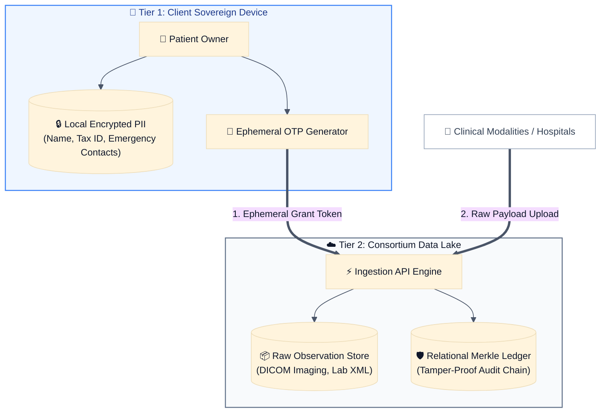
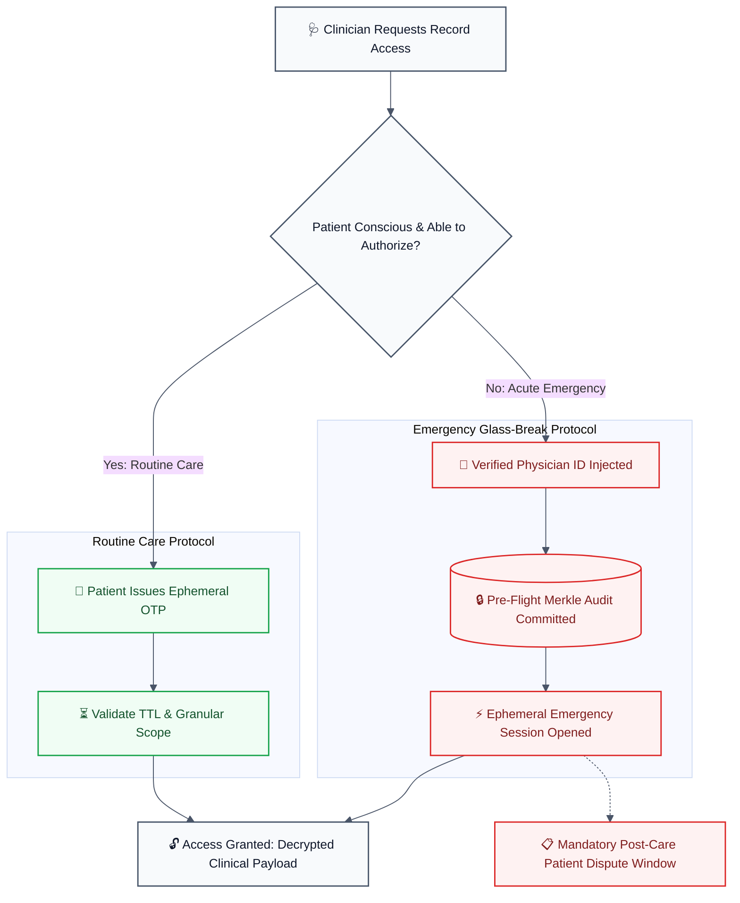

  

<h1 align="center">DataLife e-Health</h1>

  <strong>Patient-Centric Open Architecture for Heterogeneous Health Records</strong> 
  Dual-Tier Decoupled Storage • Ephemeral Dual-Key Access • Tamper-Evident Merkle Ledgers

  
  
  
  
  

  <a href="https://github.com/datalife-ehealth/datalife-datalake-core">Core Engine</a> •
  <a href="#architecture--security-boundary">Architecture</a> •
  <a href="#repository-ecosystem">Ecosystem</a> •
  <a href="#contributing--community">Join the Effort</a> •
  <a href="https://github.com/datalife-ehealth/.github/blob/main/CODE_OF_CONDUCT.md">Code of Conduct</a>

---

## Mission & Vision

DataLife e-Health decouples **what identifies a human being** from the **clinical payloads** physicians and public health registries require.

Personal Identifiable Information (PII) stays strictly sovereign on patient-controlled devices. The central data lake retains solely immutable exam streams (DICOM tomography/X-rays, lab XMLs, bio-signals), where access is deterministically sealed in a cryptographic tamper-evident ledger.

### Practical Principles

* **Patient Sovereignty**: Individuals decide who reads their clinical payload, under what granular scope, and for how long.
* **Ephemeral Clinical Grants**: Clinicians obtain time-bounded, self-expiring OTP grants instead of standing central accounts.
* **Glass-Break Emergency Bypass**: For unconscious patients, verified physicians can open emergency sessions—cryptographically logged *before* observation disclosure, and mandatorily ratified by the patient post-care.
* **Consortium-Grade Verification**: Complete data provenance is proven via chained Merkle trees without relying on public tokens, gas fees, or complex blockchain networks.

---

## System Boundaries

This organization designs and publishes **open reference software**.

* **Zero Paid Cloud Dependencies**: Local-first, self-hostable, and completely reproducible using open standards (Python 3.11+, PostgreSQL, Docker).
* **Clear Boundary**: This is not a certified commercial EHR, not a proprietary hospital billing system, and not a speculative distributed ledger. It is a cryptographic audit framework and interoperable data lake engine. The audit log is a chained Merkle ledger inside one administrative boundary.

---

## Architecture & Security Boundary

DataLife e-Health enforces zero-trust physical separation between personal identity and observation data. Personal identifiers and medical examination streams never share a unified write path or administrative domain.

### 1. Dual-Tier Decoupled Storage Topology

#### Isolation invariants

* **Zero PII Replication**: The cloud database stores pseudonymous entity hashes and payload pointers. A complete lake leak yields zero decipherable personal names or tax IDs.
* **Deterministic Provenance**: Canonical payloads are hashed into chained Merkle roots; retrospective data tampering invalidates the verification chain instantly.

### 2. Dual-Key Access & Glass-Break Protocol

Observation access requires mutual validation. Under normal workflows, patients govern disclosure. In acute clinical emergencies, a strict, auditable override protects patient survival without compromising downstream non-repudiation.

#### Protocol guarantees

* **Pre-flight tamper-evident logging.** In a glass-break override, access is written into the cryptographic Merkle chain before observation bytes are returned to the clinical display.
* **Post-incident dispute window.** When patient consciousness is restored, the client agent flags the unratified emergency session, creating an immutable audit dispute log.

---

## Repository Ecosystem

Only the core engine has a maintained implementation today. The other three names are reserved. Claim one by opening a contribution task in this profile repository before you start, so the boundary with the core stays explicit.

| Repository | Status | Primary Responsibilities | Stack | Start here |
|---|---|---|---|---|
| [datalife-datalake-core](https://github.com/datalife-ehealth/datalife-datalake-core) | Active Core | Microservice engine, multi-modal ingestion, Merkle verification, OTP/emergency auth | Python 3.11, FastAPI, PostgreSQL | [Good first issues](https://github.com/datalife-ehealth/datalife-datalake-core/issues?q=is%3Aissue+is%3Aopen+label%3A%22good+first+issue%22) |
| datalife-mobile-app | RFC / Help Wanted | Patient client: sovereign local PII encryption, exam viewer, OTP minting | Flutter / React Native | [Claim the mobile RFC](https://github.com/datalife-ehealth/.github/issues/new?template=03_contribution_task.md&title=task%3A%20datalife-mobile-app) |
| datalife-web-portal | RFC / Help Wanted | Clinician console, teleregulation workflows, glass-break audit dashboard | TypeScript, Next.js / Vue | [Claim the portal RFC](https://github.com/datalife-ehealth/.github/issues/new?template=03_contribution_task.md&title=task%3A%20datalife-web-portal) |
| datalife-infra-devops | RFC / Help Wanted | Reproducible deployment recipes, Docker Compose, Kubernetes helm charts | Docker, Terraform, K8s | [Claim the delivery RFC](https://github.com/datalife-ehealth/.github/issues/new?template=03_contribution_task.md&title=task%3A%20datalife-infra-devops) |

---

## Contributing & Community

Building transparent, privacy-first healthcare infrastructure is a collaborative mission. We cannot build this alone, and we warmly welcome contributions of all forms and sizes. A typo fix, an architecture discussion, and a pull request are all real contributions.

### How You Can Help

* **Healthcare & Public Health Practitioners**: Review our clinical access workflows and suggest real-world regulatory edge cases.
* **Backend & Cryptography Engineers**: Stress-test our Merkle tree audit structures and benchmark ingestion performance.
* **Frontend & Mobile Developers**: Help us prototype the client apps (`datalife-mobile-app` and `datalife-web-portal`).
* **Technical Writers & Translators**: Improve our documentation, deployment tutorials, and multilingual guides.

### Getting Started

Five minutes is enough to find a place to stand.

1. **Explore the code.** Check out [datalife-datalake-core](https://github.com/datalife-ehealth/datalife-datalake-core) to see the engine in action.
2. **Pick a labeled task.** Browse [good first issues](https://github.com/datalife-ehealth/datalife-datalake-core/issues?q=is%3Aissue+is%3Aopen+label%3A%22good+first+issue%22) on the core, or open an [active RFC](https://github.com/datalife-ehealth/.github/issues?q=is%3Aissue+is%3Aopen+label%3Aenhancement) if you want to shape a design before code exists.
3. **Claim empty repositories in the open.** Mobile, web, and delivery work starts as a [contribution task](https://github.com/datalife-ehealth/.github/issues/new?template=03_contribution_task.md) in this profile repository. Use the links in the ecosystem table.
4. **Propose ideas.** Have a suggestion or design critique? Open a [feature request](https://github.com/datalife-ehealth/.github/issues/new?template=02_feature_request.md).
5. **Follow the standards.** Read the [contribution guide](https://github.com/datalife-ehealth/.github/blob/main/CONTRIBUTING.md) and the [Code of Conduct](https://github.com/datalife-ehealth/.github/blob/main/CODE_OF_CONDUCT.md). Branch names use `feat/`, `fix/`, or `docs/`.

Maintained by the DataLife Open-Source Working Group & Community Stewards.
