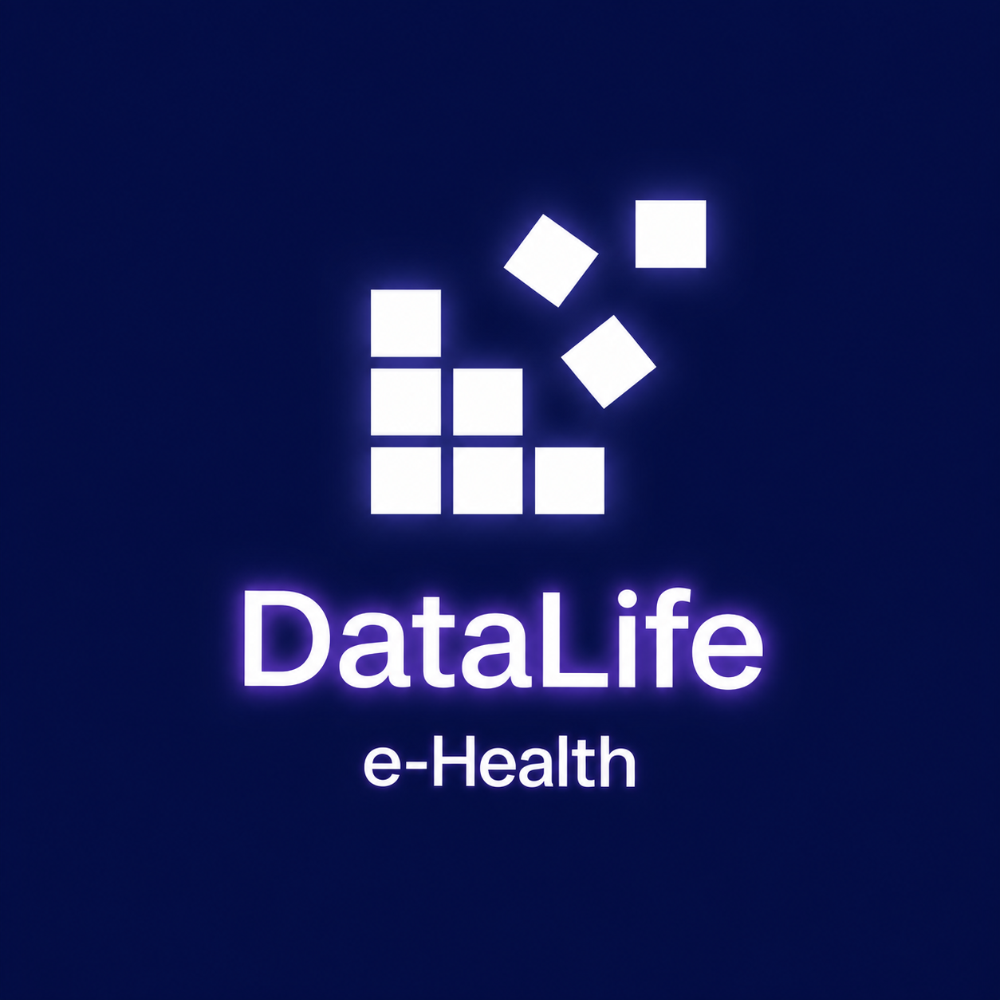
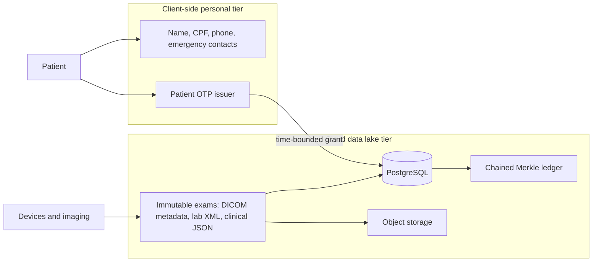
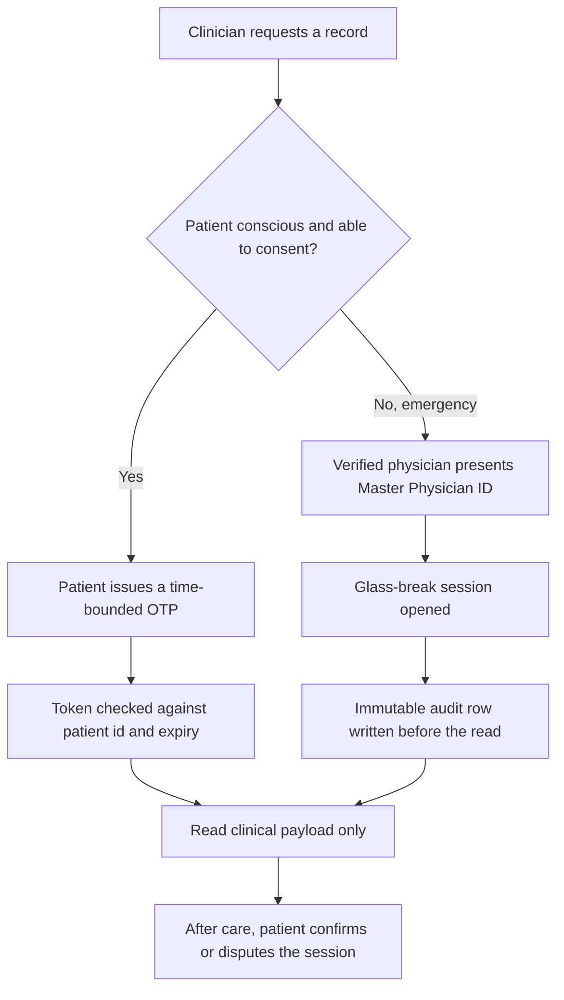

  

<h1 align="center">DataLife e-Health</h1>

  Patient-centric open architecture for heterogeneous health records. 
  Dual-tier storage. Dual-key access. Cryptographic audit inside one administrative boundary.

  <a href="https://github.com/datalife-ehealth/datalife-datalake-core">Core engine</a>
  ·
  <a href="../CONTRIBUTING.md">Contributing</a>
  ·
  <a href="../CODE_OF_CONDUCT.md">Code of Conduct</a>

## Mission

DataLife e-Health separates what identifies a person from the clinical record that clinicians and public-health systems need to keep. Personal identifiers stay on a device the patient controls. The data lake stores immutable exam payloads, device XML, and imaging metadata, and every access is written into a tamper-evident ledger.

The value proposition is practical:

- Patients decide who may read a record, and for how long.
- Clinicians receive a time-bounded token instead of a standing account on the personal store.
- An unconscious patient can still be treated: a verified physician may open an emergency session, which is logged before care and ratified by the patient afterwards.
- Operators can prove that a stored block was not rewritten, without operating a public chain or a miner network.

## System boundaries

This organization publishes reference software. It is local-first, reproducible, and free of paid cloud APIs. It is not a certified electronic health record, not a hospital information system, and not a distributed blockchain. The audit log is a cryptographic tamper-evident ledger: chained Merkle roots over canonical records, verified inside a single organization or a small consortium.

## Architecture

Personal data and clinical payloads never share a write path.

Regular access and emergency access are different keys into the same lake.

The personal tier is not replicated into PostgreSQL. The lake tier keeps exam bytes and the audit chain. A leak of the lake does not yield the patient's name, tax id, or phone number, because those fields were never written there.

## Repository ecosystem

| Repository | Status | Role |
|---|---|---|
| [datalife-datalake-core](https://github.com/datalife-ehealth/datalife-datalake-core) | Active core | Ingestion, OTP and glass-break access, Merkle verification, PostgreSQL schema |
| datalife-web-portal | RFC / Help Wanted | Clinical and teleregulation dashboard |
| datalife-mobile-app | RFC / Help Wanted | Patient application: exam list and OTP issuance |
| datalife-infra-devops | RFC / Help Wanted | Container, cluster, and delivery automation |

`datalife-datalake-core` is the only repository with a maintained implementation today. The other three are reserved names. Open a contribution task in this profile repository before starting one of them, so the boundary with the core engine stays explicit.

## Roadmap

1. **Core, now.** Multi-modal ingest, dual-key access, and Merkle verification in `datalife-datalake-core`.
2. **Patient client.** A mobile application that holds PII locally and mints OTP grants. It must not upload the personal tier.
3. **Clinical portal.** A web console for consented reads and for reviewing glass-break sessions that still need ratification.
4. **Delivery.** Repeatable containers and cluster manifests in `datalife-infra-devops`, after the core API is stable.
5. **Interoperability notes.** Document how DICOM metadata, device XML, and relational extracts land in the same ledger without collapsing them into one schema.

## Contributing

Read [CONTRIBUTING.md](../CONTRIBUTING.md) and the [Code of Conduct](../CODE_OF_CONDUCT.md). Claim work with the contribution-task issue template. Branch names use `feat/`, `fix/`, or `docs/`.

Maintainer: Luchang Jiang ([@FinalSunFlower](https://github.com/FinalSunFlower)).
