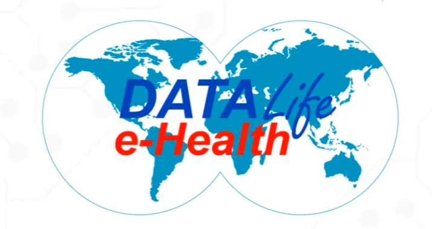
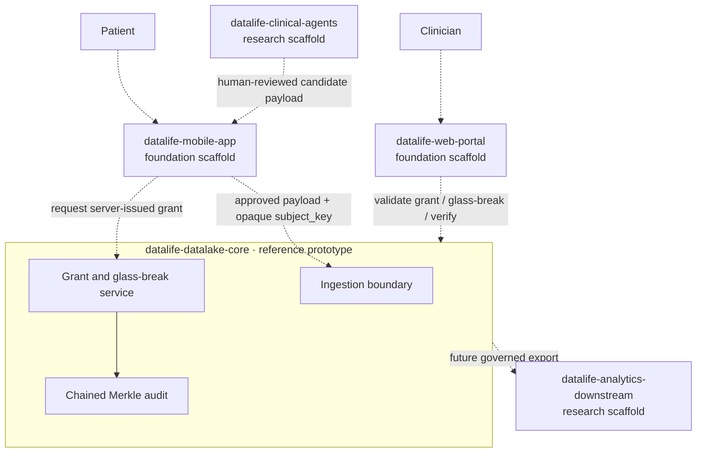

  

<h1 align="center">DataLife e-Health</h1>

  <strong>Patient-sovereign, zero-cloud-PII architecture for heterogeneous health records</strong> 
  Local identity custody · Ephemeral access grants · Tamper-evident Merkle audit chains

  
  
  
  
  

  <a href="#mission">Mission</a> ·
  <a href="#repository-ecosystem">Ecosystem</a> ·
  <a href="#current-reality">Current reality</a> ·
  <a href="#find-your-interest">Start here</a> ·
  <a href="#how-to-contribute">Contribute</a> ·
  <a href="https://github.com/datalife-ehealth/.github/discussions">Discussions</a>

---

## Mission

DataLife e-Health explores an open architecture that separates **who a person is**
from the **clinical observations used in care and research**.

The patient-controlled tier keeps direct identity data and the identity-to-subject
mapping on the user's device. The service tier accepts only an opaque `subject_key`
and approved clinical payloads, issues time-bounded access grants, and records
sensitive access events in a deterministic, tamper-evident audit chain.

> [!IMPORTANT]
> This organization publishes reference software and research scaffolds. It is not a
> certified EHR, medical device, diagnostic service, hospital billing system, or
> emergency-response system.

### One-minute orientation

| Question | Answer |
|---|---|
| What runs today? | A Python/FastAPI core reference prototype with ingestion, access-grant, glass-break, and Merkle verification primitives. |
| What is being designed? | Mobile, web, clinical-agent, and analytics foundations, each with an open `v0.1 - Foundation` milestone. |
| Where are decisions recorded? | In the relevant repository's RFC and task Issues; GitHub is the source of truth. |
| What never belongs in the cloud tier? | Direct identity records or the mapping between identity and `subject_key`. |
| What is the fastest way to help? | Pick an issue below, leave a short approach comment, and wait for maintainer assignment before substantial coding. |

## System boundary

```mermaid
flowchart TB
    Patient[Patient] -.-> Mobile["datalife-mobile-app<br/>foundation scaffold"]
    Clinician[Clinician] -.-> Web["datalife-web-portal<br/>foundation scaffold"]

    subgraph CoreRepo["datalife-datalake-core · reference prototype"]
        Ingest[Ingestion boundary]
        Grants[Grant and glass-break service]
        Audit[Chained Merkle audit]
        Grants --> Audit
    end

    Mobile -. "approved payload + opaque subject_key" .-> Ingest
    Mobile -. "request server-issued grant" .-> Grants
    Web -. "validate grant / glass-break / verify" .-> CoreRepo

    Agents["datalife-clinical-agents<br/>research scaffold"]
    Analytics["datalife-analytics-downstream<br/>research scaffold"]
    Agents -. "human-reviewed candidate payload" .-> Mobile
    CoreRepo -. "future governed export" .-> Analytics
```

Dashed edges involving peripheral repositories are planned integration boundaries;
they are not claims that those applications already exist. The core currently has no
authorized clinical-record retrieval or bulk analytics export API.

### Normal access

The core prototype can issue a time-bounded grant for an opaque subject and intended
physician, then validate that grant for a clinician-side client. The server remains
authoritative for validity and expiry; peripheral clients cannot self-authorize.

### Emergency access

The glass-break prototype checks a configured physician identifier, requires a
reason, appends an `UNCONFIRMED` event to the Merkle chain, and returns a short-lived
grant. It does **not** yet provide record retrieval, patient ratification/dispute,
durable audit persistence, or a production physician-identity system.

## Architectural invariants

Implementations may evolve, but these constraints do not change without an explicit
RFC and threat-model review:

- **Patient sovereignty.** Names, CPF or other government identifiers, phone numbers,
  email addresses, emergency contacts, and identity mappings stay in the
  patient-controlled tier.
- **Zero-cloud-PII.** Central services must not accept, retain, log, or replicate
  direct identity records. An opaque `subject_key` is still sensitive pseudonymous
  data—not anonymous or public data.
- **Server-authoritative access.** The core issues and validates ephemeral grants. A
  mobile app, web UI, model, or analytics job cannot grant itself access.
- **Tamper evidence, not blockchain.** Audit events use chained SHA-256 Merkle roots
  inside one administrative boundary. There is no token, miner, gas fee, consensus
  protocol, or peer-to-peer ledger.
- **Human authority over automation.** Agent output is untrusted and requires typed
  boundaries, deterministic validation, safe abstention, and human review before an
  external write.
- **Local-first and vendor-neutral.** The default development and test path must not
  require a paid API or proprietary EHR/cloud dependency.
- **Synthetic data by default.** Source, tests, issues, screenshots, demos, and
  research fixtures must not contain real patient information.

## Repository ecosystem

| Repository | Maturity | Owns | Stack | Active track |
|---|---|---|---|---|
| [`datalife-datalake-core`](https://github.com/datalife-ehealth/datalife-datalake-core) | **Reference prototype** | Ingestion boundary, server-issued grants, glass-break primitive, relational models, and Merkle verification. | Python 3.11+, FastAPI, Pydantic, SQLAlchemy; PostgreSQL deployment target | Persistence integration, contract hardening, parser tests, benchmarks, and security review. [Propose focused work](https://github.com/datalife-ehealth/datalife-datalake-core/issues/new/choose). |
| [`datalife-mobile-app`](https://github.com/datalife-ehealth/datalife-mobile-app) | **Foundation scaffold** | Patient-controlled PII vault, on-device key custody, consent UX, and ephemeral grant display. | Framework pending: Flutter, React Native, or a justified alternative | [`v0.1 - Foundation`](https://github.com/datalife-ehealth/datalife-mobile-app/milestone/1): framework and vault threat model. |
| [`datalife-web-portal`](https://github.com/datalife-ehealth/datalife-web-portal) | **Foundation scaffold** | Accessible clinician console for grant validation, glass-break request UX, and audit verification. | Proposed TypeScript, React/Next.js, and Tailwind; RFC may refine this | [`v0.1 - Foundation`](https://github.com/datalife-ehealth/datalife-web-portal/milestone/1): application shell and validation contract. |
| [`datalife-clinical-agents`](https://github.com/datalife-ehealth/datalife-clinical-agents) | **Research scaffold** | Human-reviewed structured intake and provider-neutral agent safety evaluation. | Proposed Python, Pydantic, and typed model/tool adapters; no framework selected | [`v0.1 - Foundation`](https://github.com/datalife-ehealth/datalife-clinical-agents/milestone/1): threat model, state machine, and adversarial evaluation. |
| [`datalife-analytics-downstream`](https://github.com/datalife-ehealth/datalife-analytics-downstream) | **Research scaffold** | Synthetic longitudinal fixtures, reproducible baselines, and future aggregate research views. | Proposed Python, pandas/Polars, PyArrow, scikit-learn/statsmodels; UI optional | [`v0.1 - Foundation`](https://github.com/datalife-ehealth/datalife-analytics-downstream/milestone/1): data contract, generator, and leakage-safe baseline. |

**Maturity matters:** only the core contains runnable product code today. The four
peripheral repositories currently contain governance, architecture boundaries, and
scoped Issues—not a selected or installed application stack.

## Current reality

| State | Verified scope |
|---|---|
| **Implemented in the core** | `/health`, OpenAPI docs, prototype JSON/XML/DICOM-body ingestion, server-side grant issue/validation, configured-physician glass-break, deterministic Merkle verification, and four unit tests. |
| **Structured but not fully wired** | SQLAlchemy relational models and PostgreSQL deployment configuration exist, while prototype ingestion, grants, and audit state remain in process memory. |
| **Not implemented** | Authorized record retrieval/decryption, durable runtime persistence, grant revocation, patient ratification/dispute, identity recovery, key rotation, and governed bulk analytics export. |

Basic identifier rejection in a prototype is not proof of anonymization. Production
privacy requires structural validation, policy enforcement, durable audit storage,
adversarial testing, and operational controls.

## Find your interest

| Your interest | Start with |
|---|---|
| Web frontend and accessible clinical UX | [Portal application shell](https://github.com/datalife-ehealth/datalife-web-portal/issues/2) or [OTP contract integration](https://github.com/datalife-ehealth/datalife-web-portal/issues/3) |
| Mobile security and client privacy | [Mobile framework/vault RFC](https://github.com/datalife-ehealth/datalife-mobile-app/issues/1) or [PII isolation tests](https://github.com/datalife-ehealth/datalife-mobile-app/issues/4) |
| AI, LLMs, and agent safety | [Intake threat-model RFC](https://github.com/datalife-ehealth/datalife-clinical-agents/issues/1) or [synthetic safety corpus](https://github.com/datalife-ehealth/datalife-clinical-agents/issues/4) |
| Data science and health analytics | [Synthetic-data contract RFC](https://github.com/datalife-ehealth/datalife-analytics-downstream/issues/1) or [dataset/study card templates](https://github.com/datalife-ehealth/datalife-analytics-downstream/issues/4) |
| Backend, APIs, or cryptographic verification | Review the [core code and tests](https://github.com/datalife-ehealth/datalife-datalake-core), then open an issue with a reproduction, contract proposal, or benchmark plan. |

These are entry points, not limits on future work. Acceptance criteria define the
minimum safe result while leaving room for well-justified designs and extensions.

## How to contribute

We use a lightweight **RFC-first** workflow for frameworks, schemas, APIs, trust
boundaries, clinical workflows, agent tools, and cross-repository changes.

1. **Pick the right issue.** Read the repository README and current milestone, then
   choose an existing task or open a focused proposal.
2. **Leave a short alignment comment before coding.** Three to five bullets are
   enough for an initial discussion:
   - the component or subtask you want to address;
   - the observable outcome and what stays out of scope;
   - your proposed tool, state flow, interface, schema, or threat mitigation;
   - the synthetic tests or other evidence you will provide.
3. **Wait for assignment.** A maintainer confirms alignment and assigns the issue. A
   comment alone is not a claim.
4. **Build and demonstrate.** Branch from `main` with `feat/`, `fix/`, `docs/`,
   `test/`, or `chore/`; submit one focused pull request with verification evidence.

Larger decisions need a full RFC discussion, but contributors do not need a long
design document merely to start a conversation. See the complete
[contribution guide](https://github.com/datalife-ehealth/.github/blob/main/CONTRIBUTING.md)
and [Code of Conduct](https://github.com/datalife-ehealth/.github/blob/main/CODE_OF_CONDUCT.md).

## Community and governance

- **Scoped work and technical decisions:** use the relevant repository's Issues and
  keep architectural rationale in the linked RFC.
- **Introductions and cross-project questions:** use
  [organization Discussions](https://github.com/datalife-ehealth/.github/discussions).
- **Security or privacy reports:** follow
  [SECURITY.md](https://github.com/datalife-ehealth/.github/blob/main/SECURITY.md);
  never post vulnerabilities, credentials, access grants, or patient data publicly.
- **DemocracyLab participants:** introduce yourself in Discussions with your GitHub
  handle and interests. GitHub remains the source of truth for scope, assignment,
  decisions, and review.
- **Governance:** organization-wide templates and policies live in
  [`datalife-ehealth/.github`](https://github.com/datalife-ehealth/.github).

## Project boundaries

- No real patient data in public repositories or community channels.
- No medical advice, diagnosis, prescribing, treatment selection, or emergency use.
- No mandatory paid service in the default development or test path.
- No hidden telemetry, undisclosed network calls, or cloud replication of direct PII.
- No production, regulatory, security, privacy, or clinical-validity claim without
  corresponding evidence and governance review.

---

  <em>Open reference architecture for patient sovereignty, auditable access, and reproducible health-data research.</em>

