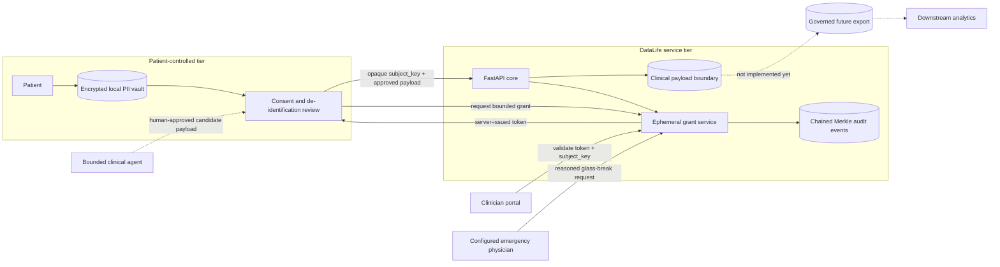

  

<h1 align="center">DataLife e-Health</h1>

  <strong>Patient-sovereign, zero-cloud-PII architecture for heterogeneous health records</strong> 
  Local identity custody · Ephemeral access grants · Tamper-evident Merkle audit chains

  
  
  
  
  

  <a href="#mission">Mission</a> ·
  <a href="#system-boundary">Architecture</a> ·
  <a href="#repository-map">Repositories</a> ·
  <a href="#where-to-start">Start contributing</a> ·
  <a href="https://github.com/datalife-ehealth/.github/discussions">Discussions</a>

---

## Mission

DataLife e-Health explores an open architecture that separates **who a person is**
from the **clinical observations used in care and research**.

The patient-controlled tier keeps direct identity data and the identity-to-subject
mapping on the user's device. The service tier accepts only an opaque `subject_key`
and approved clinical payloads, issues time-bounded access grants, and records
sensitive access events in a deterministic, tamper-evident audit chain.

This organization publishes reference software and research scaffolds. It is not a
certified electronic health record, medical device, diagnostic service, hospital
billing system, or emergency-response system.

## Architectural invariants

These constraints define the project. Implementations may evolve; the boundaries do
not change without an explicit RFC and threat-model review.

- **Patient sovereignty.** Names, CPF or other government identifiers, phone numbers,
  email addresses, emergency contacts, and the identity-to-`subject_key` mapping stay
  in the patient-controlled tier.
- **Zero-cloud-PII.** Central services must not accept, retain, log, or replicate
  direct identity records. An opaque `subject_key` is still sensitive pseudonymous
  data—not anonymous or public data.
- **Server-authoritative access.** The core service issues and validates ephemeral
  grants. A mobile app, web UI, model, or analytics job cannot grant itself access.
- **Tamper evidence, not blockchain.** The audit mechanism chains SHA-256 Merkle
  roots inside one administrative boundary. There is no token, miner, consensus
  protocol, or peer-to-peer ledger.
- **Human authority over automation.** Agent output is untrusted. Clinical-agent
  research must use typed boundaries, deterministic validation, safe abstention, and
  human review before any external write.
- **Local-first and vendor-neutral.** The reference path must remain self-hostable and
  testable without a paid API or proprietary EHR/cloud dependency.
- **Synthetic data by default.** Source code, tests, issues, screenshots, demos, and
  research fixtures must not contain real patient information.

## System boundary

```mermaid
flowchart LR
    subgraph PatientTier["Patient-controlled tier"]
        Patient[Patient]
        Vault[(Encrypted local PII vault)]
        Consent[Consent and de-identification review]
        Patient --> Vault --> Consent
    end

    subgraph ServiceTier["DataLife service tier"]
        API[FastAPI core]
        Observations[(Clinical payload boundary)]
        Access[Ephemeral grant service]
        Audit[(Chained Merkle audit events)]
        API --> Observations
        API --> Access
        Access --> Audit
    end

    Consent -->|"opaque subject_key + approved payload"| API
    Consent -->|"request bounded grant"| Access
    Access -->|"server-issued token"| Consent

    Clinician[Clinician portal] -->|"validate token + subject_key"| Access
    Emergency[Configured emergency physician] -->|"reasoned glass-break request"| Access

    Snapshot[(Governed future export)] -.-> Analytics[Downstream analytics]
    Observations -.->|"not implemented yet"| Snapshot
    Agent[Bounded clinical agent] -.->|"human-approved candidate payload"| Consent
```

### Normal access

The current prototype lets a patient-side client request a time-bounded grant for an
opaque subject and intended physician. A clinician-side client can ask the core to
validate that grant. The server remains authoritative for validity and expiry.

### Emergency access

The current glass-break prototype checks a configured physician identifier, requires
a reason, appends an `UNCONFIRMED` access event to the Merkle chain, and returns a
short-lived grant. It does **not** yet expose clinical-record retrieval, patient
ratification/dispute, durable persistence, or a complete production identity system.
Those are future contracts, not implied capabilities.

## Current implementation snapshot

The distinction between implemented code and planned work matters:

| Capability | Current reality |
|---|---|
| Health and API documentation | Implemented in the core with FastAPI (`/health`, `/docs`, `/redoc`). |
| Clinical payload ingestion | Prototype `POST /api/v1/ingest` for `json`, `xml`, and `dicom` bodies with basic identifier rejection. |
| Access grants | Prototype server-side issue and validate endpoints under `/api/v1/access/otp`. |
| Emergency glass-break | Prototype configured-physician check, reason capture, and pre-return audit event. |
| Audit verification | Deterministic SHA-256 Merkle root, chained block hash, tamper detection, and `GET /api/v1/audit/verify`. |
| Persistence | SQLAlchemy models and PostgreSQL deployment configuration exist; prototype ingestion, grants, and audit state are still in process memory. |
| Automated verification | Four core unit tests currently cover deterministic Merkle behavior, tamper detection, OTP expiry, and physician enforcement. |
| Record retrieval and decryption | Not implemented. No client may invent or bypass this contract. |
| Ratification, dispute, recovery, revocation, and bulk analytics export | Not implemented; each requires an RFC, authorization model, and threat review. |

The rejection logic in a reference prototype is not proof of anonymization. Production
privacy requires typed schemas, structural validation, policy enforcement, durable
audit storage, adversarial testing, and operational controls.

## Repository map

Status vocabulary:

- **Reference prototype:** runnable code exists; persistence and production hardening
  remain open.
- **Foundation scaffold:** governance, boundaries, and initial issues exist; no
  runnable application/package has been selected or committed yet.
- **Research scaffold:** evaluation and data contracts are being designed before an
  implementation stack is fixed.

| Repository | Status | Responsibility | Actual or proposed stack | Active track |
|---|---|---|---|---|
| [`datalife-datalake-core`](https://github.com/datalife-ehealth/datalife-datalake-core) | **Reference prototype / hardening** | Ingestion boundary, ephemeral grants, glass-break primitive, relational models, and Merkle audit verification. | Python 3.11+, FastAPI, Pydantic, SQLAlchemy; PostgreSQL deployment target | Persistence, contract hardening, parser tests, benchmarks, and security review. [Open an issue](https://github.com/datalife-ehealth/datalife-datalake-core/issues/new/choose). |
| [`datalife-mobile-app`](https://github.com/datalife-ehealth/datalife-mobile-app) | **Foundation scaffold / RFC open** | Patient-controlled PII vault, on-device key custody, consent UX, and server-issued grant display. | Framework pending: Flutter, React Native, or a justified alternative | [`v0.1 - Foundation`](https://github.com/datalife-ehealth/datalife-mobile-app/milestone/1): framework and vault threat model. |
| [`datalife-web-portal`](https://github.com/datalife-ehealth/datalife-web-portal) | **Foundation scaffold / RFC open** | Accessible clinician console for grant validation, glass-break request UX, and audit verification. | Proposed TypeScript, React/Next.js, and Tailwind; RFC may refine the stack | [`v0.1 - Foundation`](https://github.com/datalife-ehealth/datalife-web-portal/milestone/1): application shell and validation contract. |
| [`datalife-clinical-agents`](https://github.com/datalife-ehealth/datalife-clinical-agents) | **Research scaffold / RFC open** | Human-reviewed structured intake and provider-neutral agent safety evaluation. | Proposed Python, Pydantic, and typed model/tool adapters; no framework selected | [`v0.1 - Foundation`](https://github.com/datalife-ehealth/datalife-clinical-agents/milestone/1): threat model, state machine, and adversarial evaluation. |
| [`datalife-analytics-downstream`](https://github.com/datalife-ehealth/datalife-analytics-downstream) | **Research scaffold / RFC open** | Synthetic longitudinal fixtures, reproducible statistical baselines, and future aggregate research views. | Proposed Python, pandas/Polars, PyArrow, scikit-learn/statsmodels; UI optional | [`v0.1 - Foundation`](https://github.com/datalife-ehealth/datalife-analytics-downstream/milestone/1): data contract, generator, and leakage-safe baseline. |

Organization-wide governance, templates, and community documentation live in
[`datalife-ehealth/.github`](https://github.com/datalife-ehealth/.github).

## Where to start

Choose work by interest and experience. These links point to current, scoped issues;
the examples are entry points, not limits on future contributions.

| If you are interested in… | Start here |
|---|---|
| Mobile privacy and platform security | [Mobile framework and vault RFC](https://github.com/datalife-ehealth/datalife-mobile-app/issues/1) or the [PII isolation test suite](https://github.com/datalife-ehealth/datalife-mobile-app/issues/4) |
| Accessible clinical web UX | [Portal architecture RFC](https://github.com/datalife-ehealth/datalife-web-portal/issues/1) or [accessible application shell](https://github.com/datalife-ehealth/datalife-web-portal/issues/2) |
| Agent safety and evaluation | [Intake threat-model RFC](https://github.com/datalife-ehealth/datalife-clinical-agents/issues/1) or the [synthetic safety corpus](https://github.com/datalife-ehealth/datalife-clinical-agents/issues/4) |
| Reproducible health-data research | [Synthetic-data contract RFC](https://github.com/datalife-ehealth/datalife-analytics-downstream/issues/1) or [dataset/study card templates](https://github.com/datalife-ehealth/datalife-analytics-downstream/issues/4) |
| Core Python, APIs, or cryptography | Review the [core code and tests](https://github.com/datalife-ehealth/datalife-datalake-core), then open a focused issue with a reproduction, benchmark plan, or contract proposal. |

Every initial issue is intentionally extensible. Its acceptance criteria define the
minimum safe result, not the only acceptable design or the limit of the repository's
future scope.

## How to contribute

We use an **RFC-first workflow** for architecture, schemas, frameworks, trust
boundaries, new network destinations, and clinical workflows. This prevents large
pull requests from arriving after incompatible assumptions have already been made.

1. **Read the boundary.** Start with the target repository's README, security policy,
   and current milestone.
2. **Find or propose focused work.** Search existing issues. For a new direction, open
   an issue describing the user need, scope, non-goals, privacy impact, and a testable
   outcome.
3. **Align before substantial implementation.** Comment with a diagram, schema,
   threat model, wireframe, or tradeoff table. Per the contribution policy, a task is
   claimed only after a maintainer assigns it.
4. **Build a narrow change.** Branch from `main` using `feat/`, `fix/`, or `docs/`.
   Keep one concern per pull request and use synthetic fixtures only.
5. **Show evidence.** Link the issue, describe observable behavior, list verification
   commands, and include tests proportional to privacy, security, accessibility, and
   clinical-safety risk.
6. **Pass review.** Protected branches require maintainer/CODEOWNER review and resolved
   conversations. Architectural changes must preserve the invariants above or update
   an accepted RFC first.

Read the complete [contribution guide](https://github.com/datalife-ehealth/.github/blob/main/CONTRIBUTING.md)
and [Code of Conduct](https://github.com/datalife-ehealth/.github/blob/main/CODE_OF_CONDUCT.md)
before opening a pull request.

## Community and communication

- **Scoped work and decisions:** use the relevant repository's GitHub Issues. Keep
  architecture rationale in the linked RFC so future contributors can find it.
- **Cross-project questions and introductions:** use
  [organization Discussions](https://github.com/datalife-ehealth/.github/discussions).
- **Security and privacy reports:** follow the target repository's `SECURITY.md` and
  never post vulnerabilities, credentials, access grants, or patient data publicly.
- **DemocracyLab participants:** introduce yourself in Discussions and include your
  GitHub handle and area of interest. GitHub remains the source of truth for scope,
  assignment, technical decisions, and review.
- **Maintainer:** [Luchang Jiang (@FinalSunFlower)](https://github.com/FinalSunFlower).
  General project contact: `auroral.sunflower@gmail.com`.

## Project boundaries

- No real patient data in public repositories or community channels.
- No medical advice, diagnosis, prescribing, treatment selection, or emergency use.
- No paid service may become mandatory for the default development or test path.
- No hidden telemetry, undisclosed network calls, or cloud replication of direct PII.
- No claim of production, regulatory, security, privacy, or clinical validation
  without corresponding evidence and governance review.

---

  <em>Open reference architecture for patient sovereignty, auditable access, and reproducible health-data research.</em>

